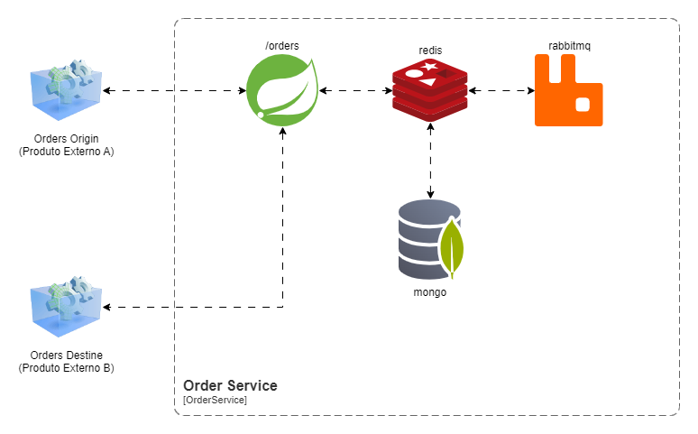

# **Order Management Application**

A Spring Boot application for managing orders and products. This project demonstrates asynchronous processing with RabbitMQ, caching with Redis, and persistent storage with MongoDB.



## **Features**
- **Order Management**: Create and retrieve orders.
- **Asynchronous Processing**: Process orders using RabbitMQ for reliable messaging.
- **Caching**: Use Redis to cache frequently accessed data.
- **Database**: Store orders and products persistently in MongoDB.
- **Validation**: Ensure data integrity using annotations like `@NotNull`, `@NotBlank`, and `@Valid`.

---

## **Technologies Used**
- **Spring Boot**: Framework for building REST APIs.
- **RabbitMQ**: Message broker for asynchronous processing.
- **Redis**: Caching layer to enhance performance.
- **MongoDB**: NoSQL database for order and product storage.
- **Lombok**: To reduce boilerplate code.
- **Java 17**: Latest LTS version for modern Java features.

---

## **Getting Started**

### **Prerequisites**
Ensure you have the following installed:
- **Java 17** or higher
- **Maven**
- **Docker** (for running RabbitMQ, Redis, and MongoDB)

---

### **Setup**

1. Clone the repository:
   ```bash
   git clone https://github.com/enok/order.git
   cd order

2. Build the project:
   ```bash
   mvn clean install

3. Run the application:
   ```bash
   mvn spring-boot:run

---

### **Testing**

1. Posting the order to be processed: [create-order.http](./src/test/resources/http/create-order.http)

2. Retrieving processed order: [get-order.http](./src/test/resources/http/get-order.http)

---

### **Monitoring**

- **Application**: http://localhost:8080/actuator
- **Redis**: 
  ```bash
  docker exec -it <CONTAINER-ID> redis-cli monitor
- **RabbitMQ (order_user | order_password)**: http://localhost:15672
- **MongoDB**: http://localhost:8081
